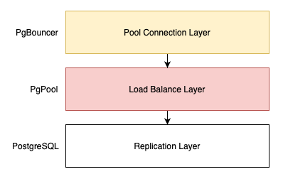
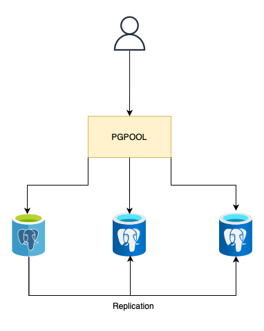
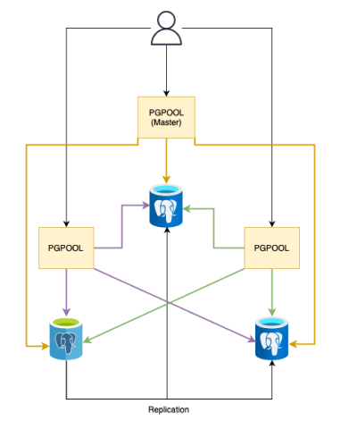
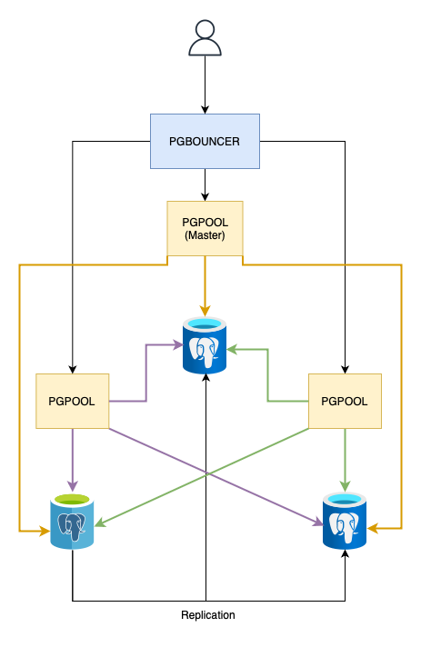
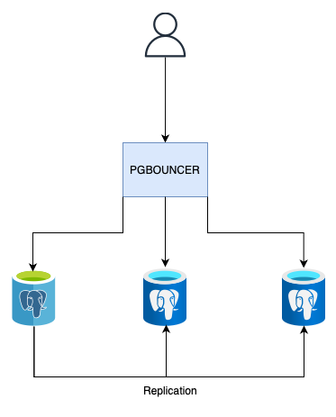

  
<h5 align="center" style="font-family: monospace;">PgCloud</h5>
 

    

  

<!-- End Header -->

    <q><b><i>&nbsp;Such as k8s but more beautiful.&nbsp;</i></b></q>

  

    <a href="./CONTRIBUTING.md">Contributing</a>
    ·
    <a href="https://github.com/ZhengLinLei/pgcloud/issues">Issues</a>
    ·
    <a href="https://github.com/ZhengLinLei/pgcloud/wiki">Wiki</a>
    ·
    <a href="./doc/wiki">Book</a>

 

    
    &emsp;    
    

 

 

## 🧐  What is PgCloud?

    PgCloud is an <code>automatic system</code> for generating distributed nodes of PostgreSQL, PgPool and PgBouncer without the need to remain on a physical machine, since it uses docker technology. The system is capable of generating Postgres nodes with database replication on the same or different machines, load balancing with PgPool and connection caching with PgBouncer.

 

  
## 📁  What does PgCloud have?

    There are several architectures offered by PgCloud tested perfectly by our team. There is even the possibility of customising the architecture with some extra configuration. The architecture is separated by layers, specifically three: <code>Replication Layer</code>, <code>Load Balancing Layer</code> and <code>Connection Pool Layer</code>.

 

### Three-tier architecture
 

    

        
    

      
    

        The <code>three-tier architecture</code> is the most used in environments where it requires much more data load and data consistency is prioritised, but its disadvantage is the time cost per request.
         
        <blockquote>
            <b><i>NOTE:</i></b> Please note that there may be a bottleneck in PgBouncer if you do not place the nodes on machines with sufficient resources.
        </blockquote>
    

 

### Two-tier architecture
 

    

        
    

      
    

        The other <code>two-tier architecture</code> is preferred for systems where time is prioritised, but the amount of load is low. It is also the fastest in preparing the cluster in case of a node failover. Since there is less communication and it is easier to reach a node agreement.
    

   
By default the system is enabled to launch this architecture.

   
## 🔌  Diagram

    Each layer architecture has different conditions of nodes to occupy, below is an example of a complete architecture with connections. Each figure represents a node and not a physical machine, the decision of putting one or two different nodes in the same machine depends on the load and stability that is desired to give to the system.

 

### Two-tier diagram
 

    
    

    <ul>
        <li>
            This is the most basic configuration that we can configure to offer load balancing. Its weakness is that it does not have a PgPool backup when a node goes down, the entire system stops receiving requests. Although it is undoubtedly the least expensive, optimal and simple for simple systems where it does not require much availability and load.
        </li>
         
        <li>
            Creating a PgPool cluster alongside the PostgreSQL cluster helps to solve both the failover of a postgres node and a PgPool node. Throughout this documentation we will use primary and replica to map the postgres and master and slave roles for the PgPool cluster.
        </li>
    </ul>

 

### Three-tier diagram
 

    

    With a three-tier architecture we have better consistency between nodes, this way if PgBouncer were to fail we could replace it with a PgPool gate, losing the capacity offered by PgBouncer but obtaining more availability. With this we are able to create a distributed system that offers load balancing and connection caching for fast management.

 

### Other architectures
 

    You can also use the system where you omit the load balancing layer, that is, use PgBouncer with Postgres. This architecture is not the most common but it does offer quite a few advantages if you only require these two modules.

    

    PgBouncer is an optimal choice for efficiently pooling database connections, especially when your system needs connection caching rather than load balancing. Unlike PgPool, which offers additional features like load balancing, PgBouncer focuses solely on connection pooling. This makes it lightweight, with lower memory consumption and minimal configuration, ideal for handling high connection rates while maintaining a stable database environment.
       
    An example using this layer is:

    

       

...

  
<h5 align="center" style="font-family: monospace;">Read more in our official Wiki or Book</h5>
 

    <a href="https://github.com/ZhengLinLei/pgcloud/wiki">Wiki</a>
    ·
    <a href="./doc/wiki">Book</a>

    

